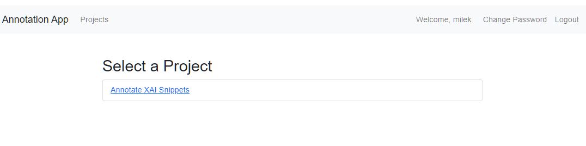
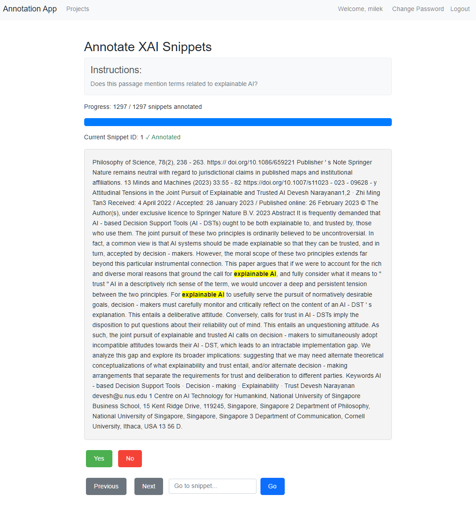
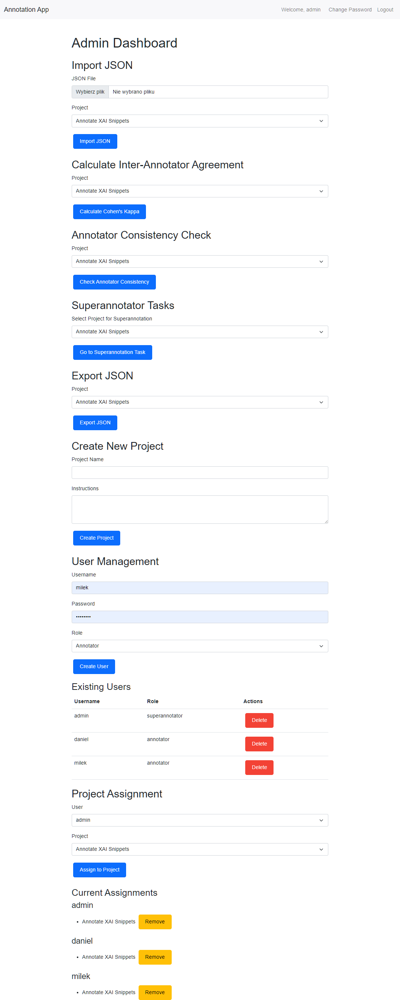

# LiteAnnotate

This is a lightweight annotation application that requires only PHP and MySQL. It's designed for efficient text classification tasks with multiple annotators.

## Features

- Accepts JSON input
- Supports two annotators and a superannotator
- Computes Cohen's kappa for inter-annotator agreement
- Highlights text parts for classification
- Currently supports binary choices (the app displays only two choices, and two buttons Yes/No)
- Includes keyboard shortcuts for annotators (space for Yes, [N] for No)
- Computes Cohen's kappa for inter-annotator agreement
- Resolves differences between annotators
- Shows consistency of decisions for the same snippet for the same annotator (if there are duplicates in your data)
- Exports results to JSON

## Requirements

- PHP
- MySQL

## Usage

1. Prepare your JSON input with the text to be annotated, including highlighted parts for classification.
2. Set up the MySQL database (see installation instructions).
3. Configure the application settings.
4. Start the annotation process with two annotators.
5. If there's divergence, a superannotator resolves the differences. Unanimous annotations are not displayed.
6. View results (you can export them to JSON) and computed Cohen's kappa.

## Keyboard Shortcuts

- Space: Select Yes
- [N]: Select No

## Screenshots







## JSON Input Format

The application expects JSON input in the following format:

```json
[
{
  "type": "1_par",
  "content": "This is a snippet to annotate",
  "kwic": "snippet",
  "id": 1
}
]
```

Where:
- `type`: Specifies the type of content (e.g., "1_par" for one paragraph)
- `content`: The full text to be annotated
- `kwic`: The key words in context, which will be highlighted for classification
- `id`: A unique identifier for the annotation task

Ensure your JSON input follows this structure for proper functioning of the annotation app.

## Installation

1. Copy files to your web server.
2. Adapt the database configuration file (`config/database_config.inc.php`) to match your database settings. The file `config/config.inc.php` configures further web-related settings (host name and the number of items per page).
3. Create the necessary database tables using setup_database.php. For security purposes, I advised removing the setup_database.php file afterr setting up the database.

## Configuration

Set up the admin account. The admin can assign annotators and superannotators.


## License

This project is licensed under the MIT License. See the [LICENSE](LICENSE) file for details.

## Author

(C) Marcin Miłkowski, 2024

## Contributing

Contributions are welcome! Please feel free to submit a Pull Request.
