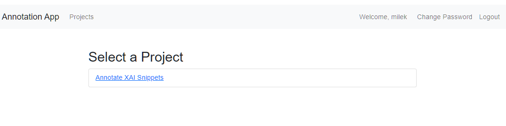
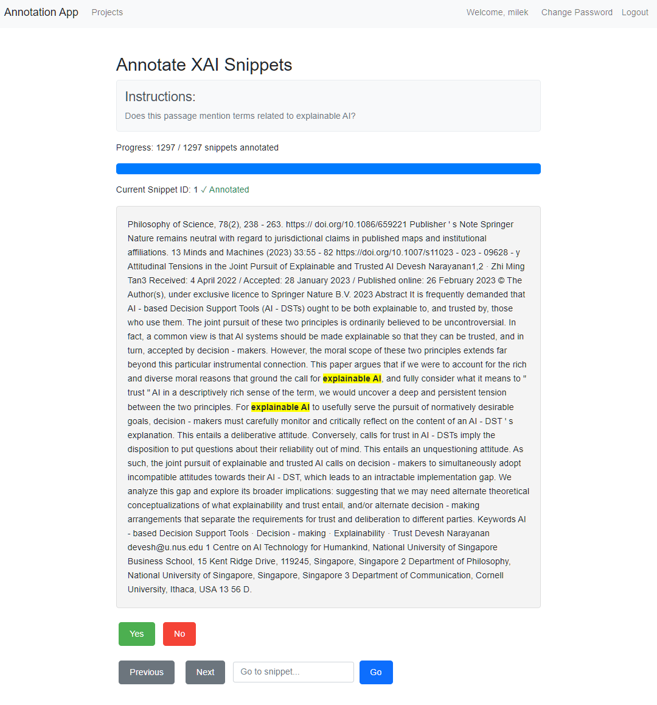
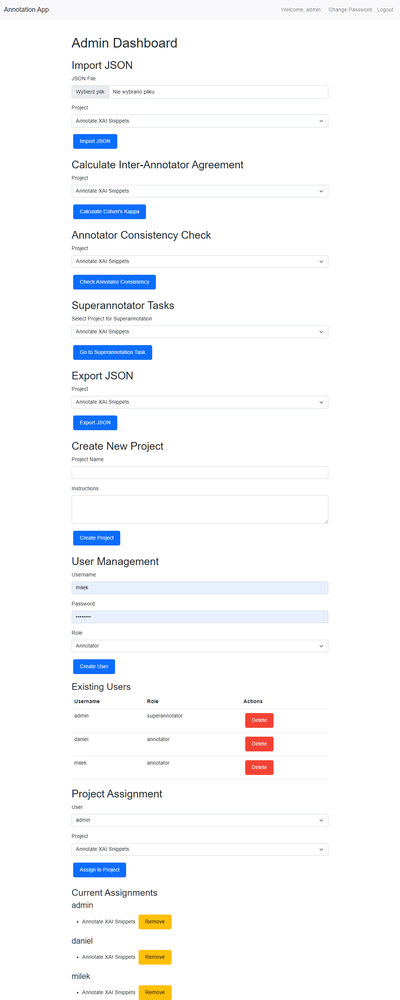

# LiteAnnotate

This is a lightweight annotation application that requires only PHP and MySQL. It's designed for efficient text classification tasks with multiple annotators.

## Features

- Accepts JSON input
- Supports multiple annotators and a superannotator
- Highlights text parts for classification
- Supports per-project multiple-choice label sets with fast numeric shortcuts
- Computes average pairwise Cohen's kappa and nominal Krippendorff's alpha for inter-annotator agreement
- Resolves differences between annotators
- Shows consistency of decisions for the same snippet for the same annotator (if there are duplicates in your data)
- Exports results to JSON
- Includes a PHPUnit-based unit-test suite for the shared annotation logic

## Requirements

- PHP
- MySQL

## Usage

1. Prepare your JSON input with the text to be annotated, including highlighted parts for classification.
2. Set up the MySQL database (see installation instructions).
3. Configure the application settings.
4. Create a project and define its choices in the admin interface, or keep the default Yes/No choices.
5. Start the annotation process with your annotators.
6. Use the admin dashboard to review agreement statistics and export results.
7. If there's divergence, a superannotator resolves the differences. Unanimous annotations are not displayed.

## Keyboard Shortcuts

- Press the number shown on a choice button to submit that label.
- Choice shortcuts are configured per project in the admin interface.

## Screenshots







## JSON Input Format

The application expects JSON input in the following format:

```json
[
{
  "type": "1_par",
  "content": "This is a snippet to annotate",
  "kwic": "snippet",
  "id": 1
}
]
```

Where:

- `type`: Specifies the type of content (e.g., "1_par" for one paragraph)
- `content`: The full text to be annotated
- `kwic`: The key words in context, which will be highlighted for classification
- `id`: A unique identifier for the annotation task

Ensure your JSON input follows this structure for proper functioning of the annotation app.

## Installation

1. Copy files to your web server.
2. Adapt the database configuration file (`config/database_config.inc.php`) to match your database settings. The file `config/config.inc.php` configures further web-related settings (host name and the number of items per page).
3. Create or update the necessary database tables by running setup_database.php. Re-running the script also upgrades older binary-only installations to the current multiple-choice schema. For security purposes, remove setup_database.php after setup is complete.

## Configuration

Set up the admin account. The admin can assign annotators and superannotators, create projects, and define each project's available labels with optional numeric shortcuts.

## Choice Configuration

Projects store their choices independently. In the admin interface, enter one choice per line using this format:

```text
Label | Shortcut | Value
Yes | 1 | yes
No | 2 | no
Maybe | 3 | maybe
```

- `Label` is what annotators see.
- `Shortcut` is the single key used for quick selection.
- `Value` is the stable stored/exported value.

If you leave the field blank, the project falls back to the default `Yes` / `No` choices.

## Statistics

- Average pairwise Cohen's kappa remains available for pairwise agreement tracking.
- Nominal Krippendorff's alpha is available in the admin dashboard and works for multi-class annotation projects.

## Tests

The repository includes unit tests for the shared annotation logic in `tests/AnnotationCoreTest.php`.

Run the suite with a local PHPUnit 12 installation:

```bash
phpunit --configuration phpunit.xml.dist
```

## License

This project is licensed under the MIT License. See the [LICENSE](LICENSE) file for details.

## Author

(C) Marcin Miłkowski, 2024-2026

## Contributing

Contributions are welcome! Please feel free to submit a Pull Request.
